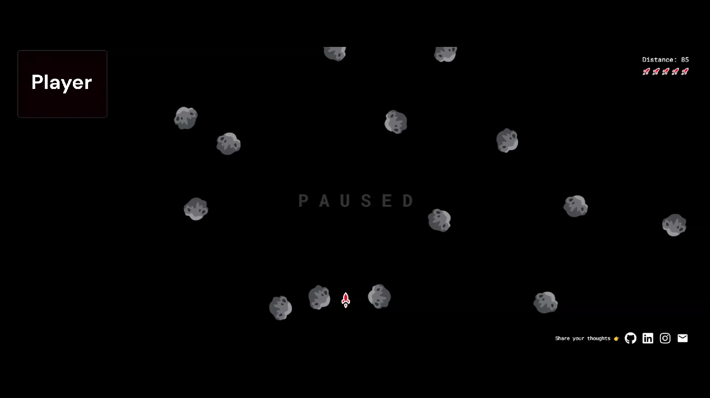

# Rocket Rush [```live```](https://rocket-rush-chirag-khaitan.vercel.app)

Welcome to **Rocket Rush**, a thrilling web game inspired by the classic 'Space Impact'. Control your rocket using hand gestures, avoid meteors, and enjoy immersive sound effects. Experience the excitement of space adventures with cutting-edge technology!



## Table of Contents

- [Features](#features)
- [Demo](#demo)
- [Installation](#installation)
- [Usage](#usage)
- [Controls](#controls)
- [Technologies Used](#technologies-used)
- [Contributing](#contributing)
- [Contact](#contact)

## Features

- **Hand Gesture Control:** Utilize Mediapipe to control the rocket with hand gestures.
- **Collision Detection:** Detect collisions with meteors for an engaging gameplay experience.
- **Sound Effects:** Experience dynamic sound effects powered by Tone.js.
- **Smooth Animations:** Experience smooth and fluid animations for a seamless gaming experience.

## Demo

Check out the live demo of Rocket Rush here [Click to Play](https://rocket-rush-chirag-khaitan.vercel.app).

## Installation

To run Rocket Rush locally, follow these steps:

1. **Clone the repository:**
    ```bash
    git clone https://github.com/TheChiragKhaitan/Rocket-Rush.git
    cd Rocket-Rush
    ```

2. **Install dependencies:**
    ```bash
    npm install
    ```

3. **Start the development server:**
    ```bash
    npm run dev
    ```

4. Open your browser and navigate to `http://localhost:3000` to start playing.

## Usage

- **Launch the game:** Open the game in your browser.
- **Allow camera access:** Grant camera access to enable hand gesture recognition.
- **Start playing:** Use your hand gestures to control the rocket and avoid meteors.

## Controls

- **Move Left:** Move your hands to the left.
- **Move Right:** Move your hands to the right.

## Technologies Used

-   **Nextjs**
  
-   **MediaPipe** 

-   **Tone.js**

-   **ShadcnUi**

-   **Vercel**
  

## Contributing

Contributions are welcome! If you have any suggestions or find any issues, please feel free to open an issue or a pull request. 

## Contact

If you wish to connect with me, you can reach out through the following channels:

<div align="center">
  <a href="https://www.linkedin.com/in/chirag-khaitan" target="_blank">
    
  </a>
  
  <a href="mailto:chiragkhaitan2014@gmail.com" target="_blank">
    
  </a>
  
  <a href="https://www.instagram.com/thechiragkhaitan" target="_blank">
    
  </a>
</div>

© 2024 Chirag Khaitan


Enjoy playing Rocket Rush 🚀!
